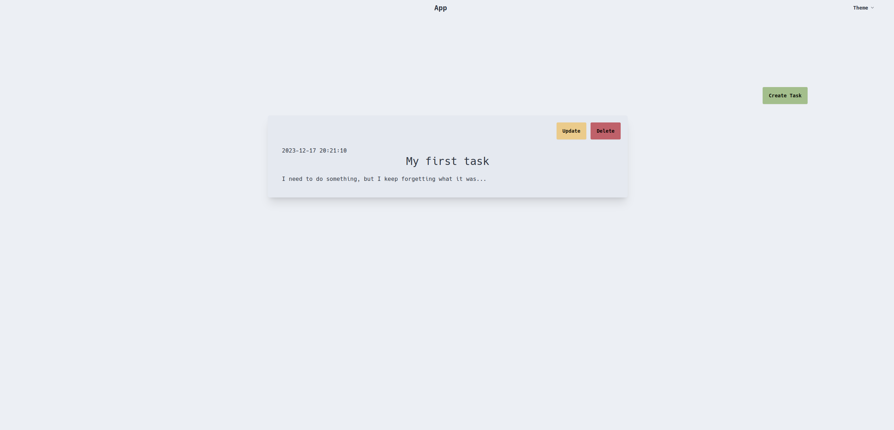

# Go Web Application Structure (gowas for short)

> A simple yet scalable web application structure for Go projects.

This project offers an opinionated web application structure for applications written in Go. While it's important to note that this structure may not align with all Go idioms, I hope it provides valuable insights into the reasoning behind certain design choices.

## Principles

- **Auto database migration**: Applied by the application itself on startup.
- **Configuration via env vars**: Solely done through environment variables.
- **Command line argument support**: Used to define runtime behavior.
- **Code resides in single folder**: Application code is contained within a single folder, e.g., /src.
- **OCI Image output**: Focus on OCI image as the 'executable' output format (via [#ko](ko)).
- **Logger and Config are global variables**: logger and config are global for widespread usage.
- **Domain Object**: A single object, called domain, is used to bootstrap business logic.
- **Graceful Shutdown**: Cleanup your app nicely without loosing requests.
- **Ingress handling**: Ingress is not part of your domain, but interacts with it.
- **Auto retry external services**: Service connections, like database connections, are auto-retried on startup.

## Tools used

- GoFiber
- sqlc
- dbmate
- HTMX
- Tailwind
- DaisyUI
- argocd
- ko

## Usage

1. `git clone github.com/sevaho/gowas && cd gowas`
2. `cp .env.example .env`
2. `go mod tidy`
3. `npm install`
4. `make sqlgen`
5. `make cssgen` (needs to run continuously, for example in seperate terminal)
6. `make compose` (needs to run continuously, for example in seperate terminal)
7. `make run` (needs to run continuously, for example in seperate terminal)

> The `Kubernetes-application.yaml` file is purely to give an idea on how to deploy to Kubernetes.

## What you will get once it runs



## Testing

I found it quite difficult to run integrations tests when needing 3th party dependencies (postgres, redis, nats, ...), so I moved the testing folder outside of the application folder, which can feel odd for Go application structures.

Run: 

```
$ make test
```

## Why X

### Why Makefile

Although it has it's quirks (try passing dynamic arguments to a make command), the limitation it has are also its strenght.

### Why Sqlc

> If you love writing SQL statements, you will love sqlc

I think this library is one of those libraries that once you see it, you put it in your toolbelt and make it your go to database handler.
The idea of sqlc is that you write sql first and then generate your code, which is... awesome!

### Why Ko

> OCI container builder with SBOM and Kubernetes integration.

[Ko](https://github.com/ko-build/ko) is a newer way to build OCI compatible containers without using the `docker` binary.
Amazing tool to work with if you are deploying to Kubernetes.

### Why ArgoCD

I like the unix philosphy of doing 1 thing well. When it comes to CI/CD, there are a lot of moving pieces and most CI/CD tools are doing a lot at the same time.
ArgoCD is in my opinion a tool that does 1 thing well and that is, making it incredibiliy easy to deploy applications on Kubernetes.
But this means that ArgoCD is not a full application delivery pipeline, you will still need a CI system (github actions), an artifact manager (Harbor), and security/delivery checks/tests in place.

TLDR: ArgoCD makes Kubernetes less complex.

### Why ingress layer is not part of your domain, but interacts with it

I want to have a clean abstraction between ingress and domain. An ingress layer should 'click' onto your domain and not the other way around.
Another 'ingress layer' I use often is nats, this is also something that should click onto your domain.

## Ways to improve the project

- [ ] Add notifications and render components via websockets 

## Share Your Thoughts

If you have feedback on the application structure, feel that something is missing, or have questions, please don't hesitate to create a GitHub issue. Your input is valuable, and we're here to help!
